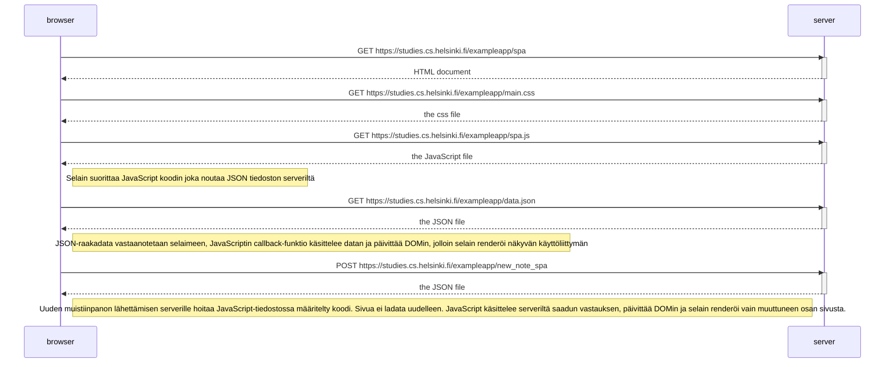

```mermaid
sequenceDiagram
    participant browser
    participant server
    
    browser->>server: GET https://studies.cs.helsinki.fi/exampleapp/spa
    activate server
    server-->>browser: HTML document
    deactivate server

    browser->>server: GET https://studies.cs.helsinki.fi/exampleapp/main.css
    activate server
    server-->>browser: the css file
    deactivate server

    browser->>server: GET https://studies.cs.helsinki.fi/exampleapp/spa.js
    activate server
    server-->>browser: the JavaScript file
    deactivate server

    Note right of browser: Selain suorittaa JavaScript koodin joka noutaa JSON tiedoston serveriltä

    browser->>server: GET https://studies.cs.helsinki.fi/exampleapp/data.json
    activate server
    server-->>browser: the JSON file
    deactivate server

    Note right of browser: JSON-raakadata vastaanotetaan selaimeen, JavaScriptin callback-funktio käsittelee datan ja päivittää DOMin, jolloin selain renderöi näkyvän käyttöliittymän

    browser->>server: POST https://studies.cs.helsinki.fi/exampleapp/new_note_spa
    activate server
    server-->>browser: the JSON file
    deactivate server

    Note right of browser: Uuden muistiinpanon lähettämisen serverille hoitaa JavaScript-tiedostossa määritelty koodi. Sivua ei ladata uudelleen. JavaScript käsittelee serveriltä saadun vastauksen, päivittää DOMin ja selain renderöi vain muuttuneen osan sivusta. 


```
